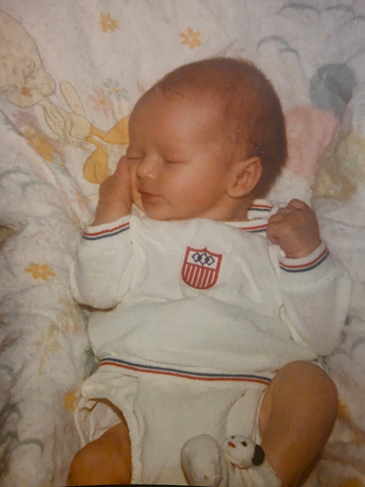
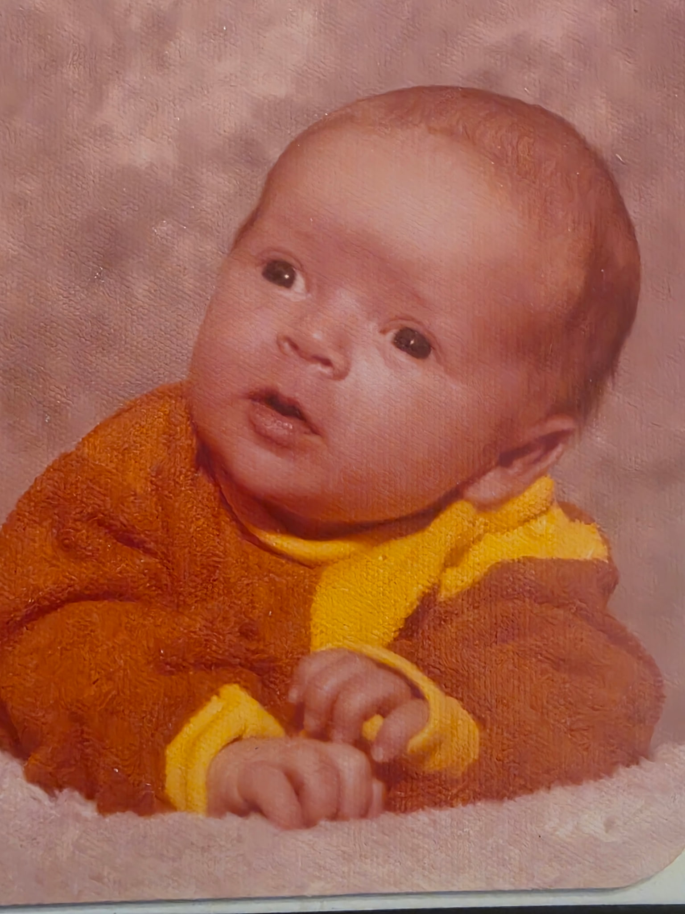

+++
date = '2026-03-20T14:57:26-06:00'
draft = true
title = 'My Birth'
categories = ['Early Childhood and Heritage']
tags = ['Dad', 'Grandma Jan', 'Grandpa Steve']
image = "cover.jpg"
[song]
	title = "Birthday Party"
	artist = "AJR"
	apple = "https://music.apple.com/us/album/birthday-party/1710154567?i=1710154569"
+++

## What is your birthday and what time of day were you born?  Where were you born?

On September 19, 1978, Jeffery Steven Winget came into the world.[^1]  I asked Grandma Jan for information about my birth, and she couldn't remember.  We decided during our conversation that her lack of memory about the birth of her favorite child probably means that it was uneventful, even if my life wasn't.

I do know the rest of the specifics from the question, however.  I was born at Cottonwood Hospital in Murray, Utah.  Even though I know you will all want to visit the place of my birth, it no longer exists.  It was closed in 2007 when the new IHC Hospital was built nearby (Owen was born in that new hospital, btw), and it was torn down in 2009.[^2]  

Grandma doesn't remember the specific time that I was born.  Maybe one day, I'll track down my birth certificate and be able to tell you, but the little details seem less important than the stories in this space.  I was born during the day, and it was scheduled.  My due date was October 1st, and the doctor was worried about how small Grandma was and the potential for complications if she carried me to term.

It turns out that there was no need to worry.  I was a small baby: 6 lbs 6 oz, and the birth was so simple (or I'm so incredibly awesome) that Grandma can't remember it.  

The last thing to talk about with this prompt is my name.  You noticed in the beginning that my name was spelled "Jeffery" when I was born.  Weird things happen to teachers when we try to name our children.  There are names that I could never use to name my kids because they remind me of students who drove me crazy.  Grandma's reason for changing my name was a little different than that, but it's in the same general theme.

The year I was born, Grandma had a "Jeffery" in her class at school.  That student was a girl.  So, not wanting me to have the feminine spelling of the name they had carefully chosen for me (more on that in a minute, too), they worked for almost a year to change the spelling to the--at least what they thought--masculine spelling of "Jeffrey."

In reality, my name was incredibly common that year.  There were 4 Jeffs that lived in our ward that were about my age: One "Jeffery," two "Geoffreys," and one "Jeffrey"--me.

## Are there any stories about your birth that were told to you by your parents or other family members?

The one story that I remember people telling me is that Grandma and Grandpa were both convinced that I would be a girl.  Liza and I were the first Peacock babies born, so the pattern of Peacock boy babies had yet to be established.  They were so convinced that I would be a girl that they didn't even choose a boy name.  

Until I shocked the world by being a boy, my name was "Stephanie."  I'm sure my life would have been wildly different if that was how things turned out.  I'm grateful to be Jeffrey and to be a man.  Otherwise, I could never have been your dad.

## Today's Song



[^1]: Not a typo.  More on that in a minute.
[^2]: Read more [here](https://www.ksl.com/article/7329187/cottonwood-hospital-torn-down-to-make-way-for-new-medical-campus)
