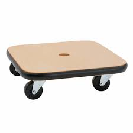

+++
date = '2026-04-07T06:19:34-06:00'
title = 'My Dad'
categories = ['Early Childhood and Heritage']
tags = ['Grandpa Steve']
image = 'cover.JPG'
[song]
	title = "Monsters"
	artist = "James Blunt"
	apple = "https://music.apple.com/us/album/monsters/1477361268?i=1477361272"
+++

## What is your father's full name, and when and where was he born?

Steven Frank Winget was born May 28, 1951.  He passed away on February 26, 2022.  This isn't going to be an obituary, however.  I struggled enough to write that once, so I'm not going to do it again.[^1]

I don't know a lot about my dad's life when he was younger.  The little I do know is that it was a pretty typical childhood for a boy in the 50s and 60s.  A graduate of Hillcrest High School, he loved to hike and be outdoors, and he was politically active protesting the Vietnam War.  

Speaking of the war, Grandpa was a conscientious objector and vehemently opposed to being a part of the war effort. Even though his draft number was 9, he managed to stay at home by staying in school.  If his educational deferments had ever run out, Aunt Liza and I would likely have been born in Canada since Dad would have moved there to avoid the draft as so many others did.  I admire him for his consistency in his convictions.

## Describe your father.  What did he do for a living?  What were his hobbies?

Grandpa Steve did a lot of jobs throughout his life.  Before the divorce, he worked as the head custodian of Castle Dale Elementary School.  Having both parents work in schools meant that I spent so much time running around hallways, rolling around the gym on wooden death scooter boards, and swinging on the monkey bars on the playground.  Both schools played a huge role in my upbringing.  

Sometime when I was in early elementary school, Grandpa Steve went to massage school at the Mayo Therapy Massage School.  This required him to be gone a lot.  He would stay at his parents house in Midvale and attend school during the week and come home on the weekends.  When he was home, he would practice his massage techniques on us.  I think my ability that I have to this day of completely relaxing during a massage comes from that time.  I allowed myself to completely submit to massage as a child, so it is easier to trust as an adult.

Sometime during his journey to learn massage, my Dad moved out of the house and into a small apartment in Castle Dale.  I don't ever remember my parents fighting or any signs of trouble until then.  It wasn't long after that that they announced they were getting divorced, and Dad was moving to Salt Lake.

For the purpose of this story, I would really like to focus on a couple of strong memories that I have of my Dad from when I was young.

There are two memories that stand out among the rest because they are hobbies that my Dad passed on to me.  The first is hiking.  Some of my earliest memories are hiking with my Dad.  I'm not sure I remember one particular hike, or if my memories are a mix of many.  However, there are two places that we hiked often that I remember well.  The first was walking down a service road to the base of the Joe's Valley Dam.  It was about a mile each way, and the mile out was an uphill grind.  Later as a teenager, my friends and I would take that same service road down to the river to fish.  

The place I remember the most with Dad is Winks Canyon.  It sits down the road from where we used to camp for the 4th of July.  There used to be a trail running up the bottom of the canyon next to the stream, but it is really overgrown now.  With Dad, Aunt Liza and I would walk up the base of the canyon until it started to climb.  Then, we would weave our way through the trees until we were near the top of Trail Mountain.  Near the top is what Dad called "the bowl."  Basically, it was when we got high enough to leave the treeline and sit in the upper bowl of the canyon below the top of the mountain.  Mountaineers would probably call it a "col," but I didn't learn that word until much later.

Up in the bowl, Dad would build a small fire and cook a can of soup for each of us.  We would eat the soup out of the can and visit, enjoying the view before heading down. I still love the mountains and love hiking in them to this day.

The second memory I have with my Dad is playing chess.  Dad was a good chess player.  He almost exclusively played the Queen's Gambit, and he enjoyed positions that were predictable.  As I learned the game more in my 20s, I could exploit that, and I finally started winning games against him by making the positions uncomfortable, chaotic, and unpredictable.  In a way, our chess styles reflect our personalities.  Grandpa Steve liked things to stay the same, be predictable, be planned, and not change.  I like to change and grow, to try new things, and to push limits.  

I like to say that I got the best parts of both my Mom and my Dad.  I'm very grateful to both of them.  I learned a lot from them, and I wouldn't be who I am today without my wonderful parents.

## Today's Song



[^1]: Here is [the link to Dad's obituary](https://www.goffmortuary.com/obituaries/steven-winget).  It still represents one of the hardest things I've ever had to write.